# NETWORKWALKS-WK3-PASSWORD-CRACKING

# NetworkWalks Internship – Week 3

## Project Module 1: Password Cracking with JTR

### Overview

As part of Week 3 of my NetworkWalks cybersecurity internship, I worked on a practical password-cracking lab using **John the Ripper (JTR)** and **Johnny**.

The objective was to recover the password of an authorized password-protected PDF and understand the basic process of password recovery.

### Tools Used

* John the Ripper (JTR)
* Johnny GUI
* Windows
* PDF Hash Extractor
* Notepad

### Task

Crack the password of the provided `My Locked PDF1.pdf`,`My Locked PDF2.pdf`,`My Locked PDF3.pdf` using John the Ripper and Johnny.

### Step 1 – Install John the Ripper

Downloaded and installed John the Ripper on the Windows system.

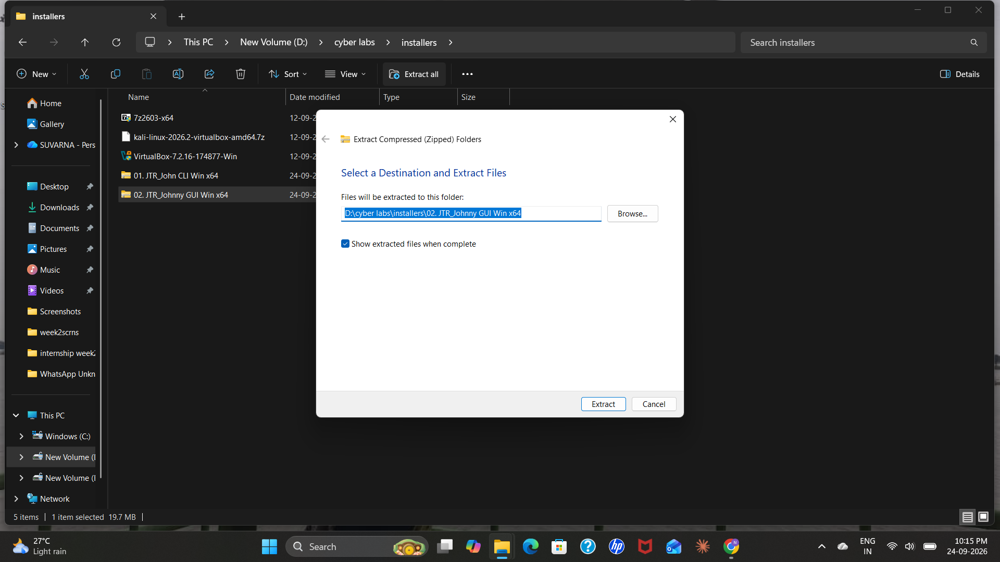

### Step 2 – Install and Configure Johnny

Installed Johnny and configured it by selecting the `john.exe` file from the JTR `run` folder.

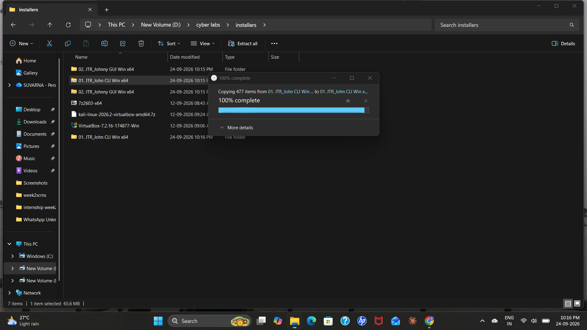

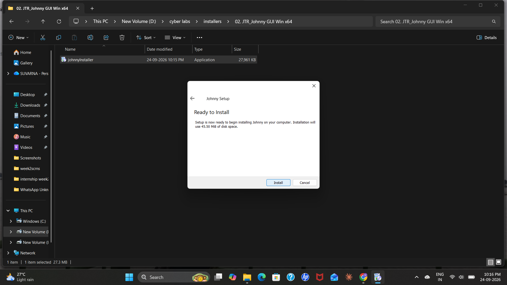

### Step 3 – Extract the PDF Hash

Uploaded the authorized password-protected PDF to the PDF hash extraction tool and obtained its hash value.

The hash was saved in a text file named `hash1.txt`.

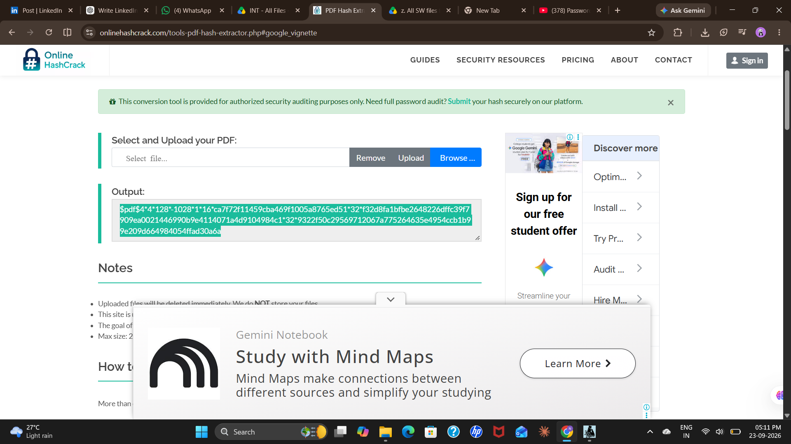

### Step 4 – Load the Hash into Johnny

Opened Johnny and loaded the `hash1.txt` file using **Open Password File**.

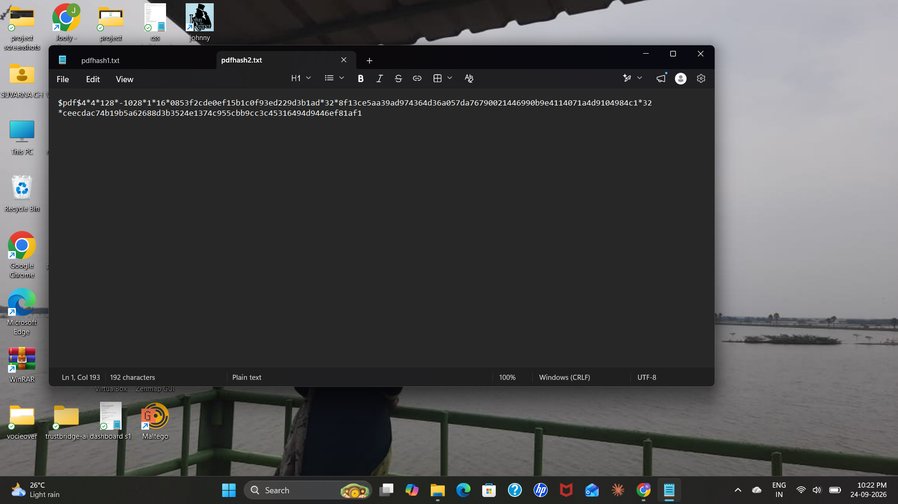

### Step 5 – Start Password Recovery

Started a new attack in Johnny using the loaded hash.

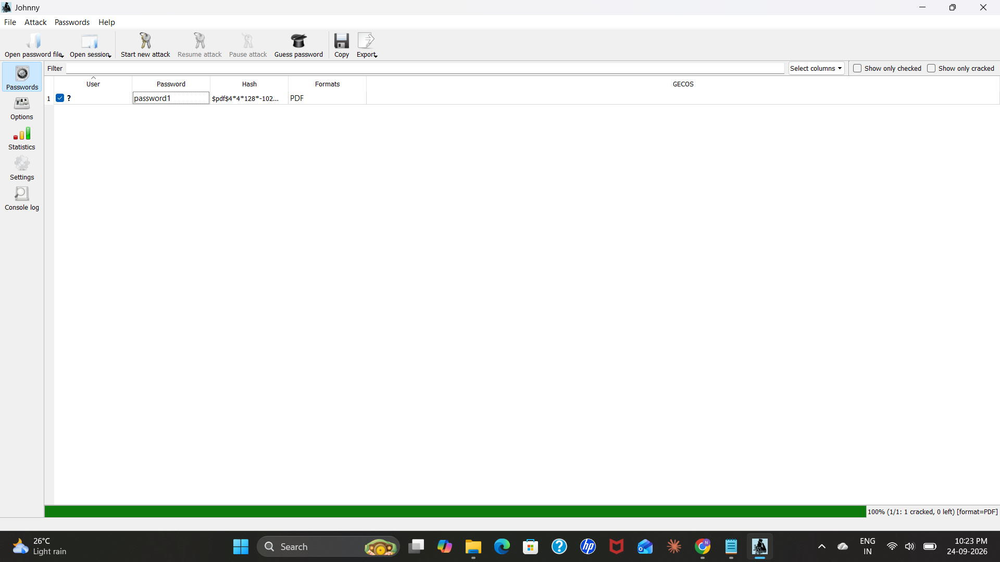

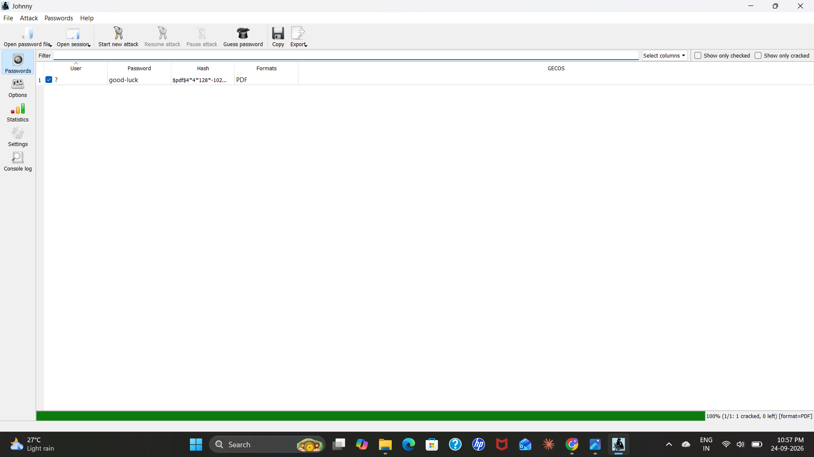

### Step 6 – Verify the Password

Used the recovered password to open the protected PDF and verify the result.

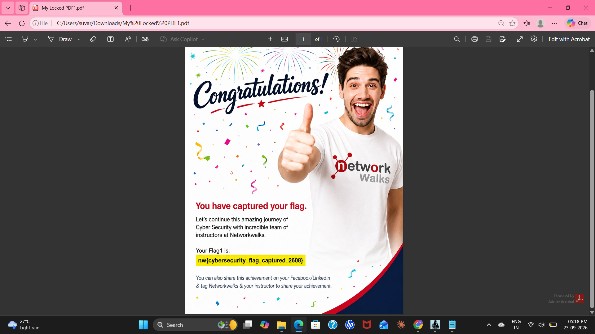

### Result

Successfully completed the **Password Cracking with JTR** practical module using John the Ripper and Johnny.

---

# Project Module 2: Password Cracking with NetworkWalks Tools

### Overview

In this module, I worked with the **NetworkWalks Hash Calculator** and **Password Cracker** to understand the basic process of recovering a password from a protected PDF.

### Tools Used

* NetworkWalks Hash Calculator
* NetworkWalks Password Cracker
* Windows
* Web Browser

### Task

Crack the password of the provided `My Locked PDF1.pdf` ,`My Locked PDF2.pdf`, `My Locked PDF3.pdf`using the NetworkWalks Hash Calculator and Password Cracker.

### Step 1 – Download the PDF

Downloaded the provided password-protected PDF from the NetworkWalks lab page.

### Step 2 – Open Hash Calculator

Opened the NetworkWalks Hash Calculator in a web browser.

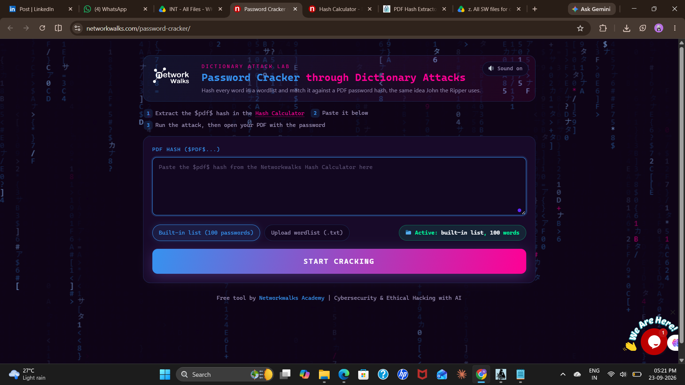

### Step 3 – Upload the PDF

Uploaded the locked PDF to the Hash Calculator to generate its hash value.

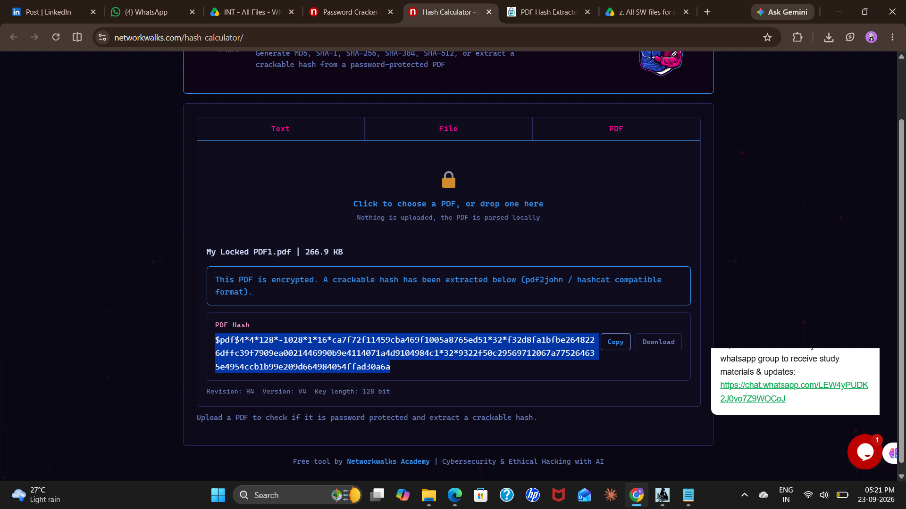

### Step 4 – Copy the Hash

Copied the complete hash value generated by the Hash Calculator.

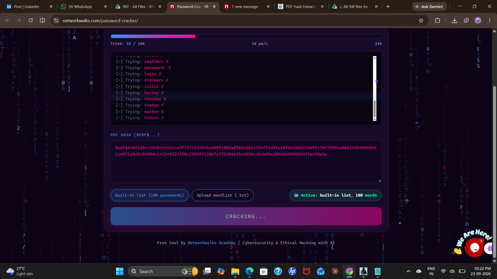

### Step 5 – Open Password Cracker

Opened the NetworkWalks Password Cracker in the browser.

### Step 6 – Start Password Recovery

Pasted the complete hash into the Password Cracker and started the password recovery process.

### Step 7 – Check the Recovered Password

Waited for the process to complete and checked the recovered password.
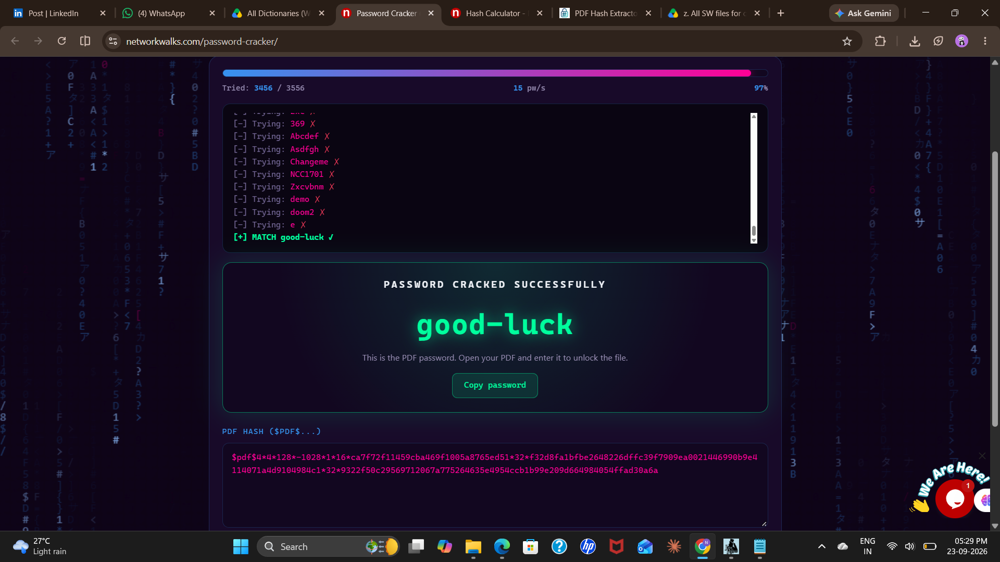
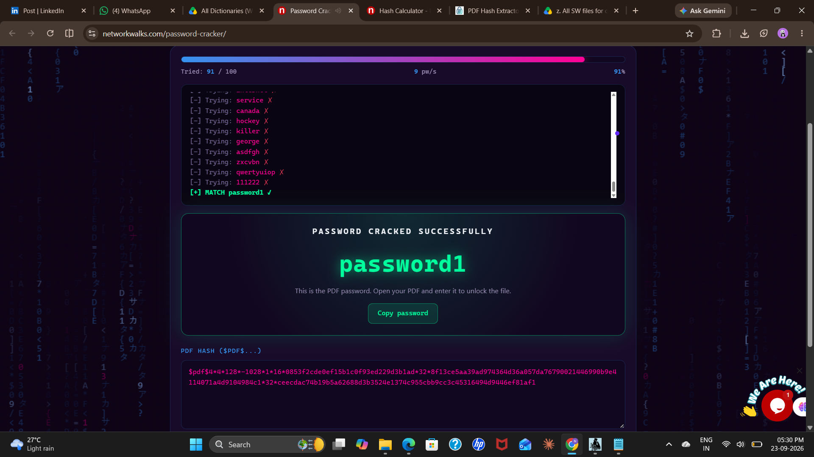
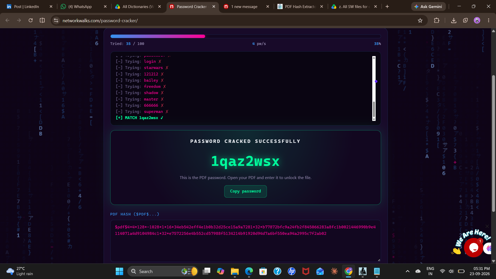

### Step 8 – Verify the Password

Entered the recovered password into the protected PDF.

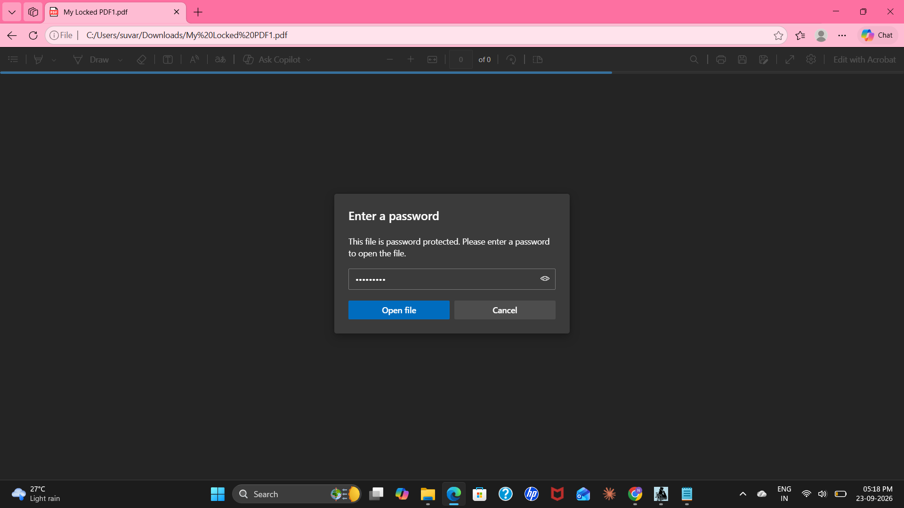

### Step 9 – Verify the Result

The PDF opened successfully, completing the practical task.

Challenge & Troubleshooting
I encountered an issue with the while cracking the password in networkwalks tool after i uploaded the wordlist its cracked the password.

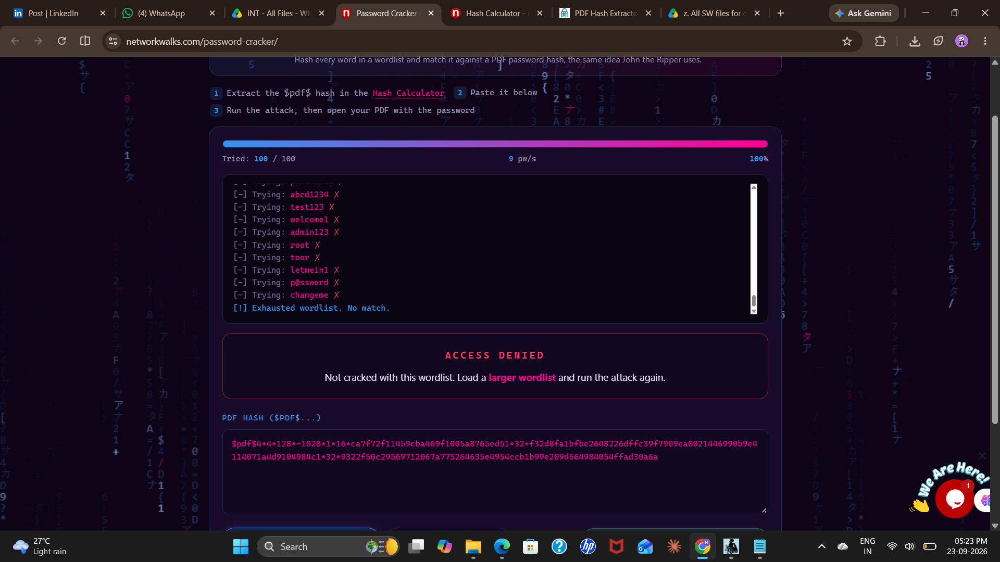
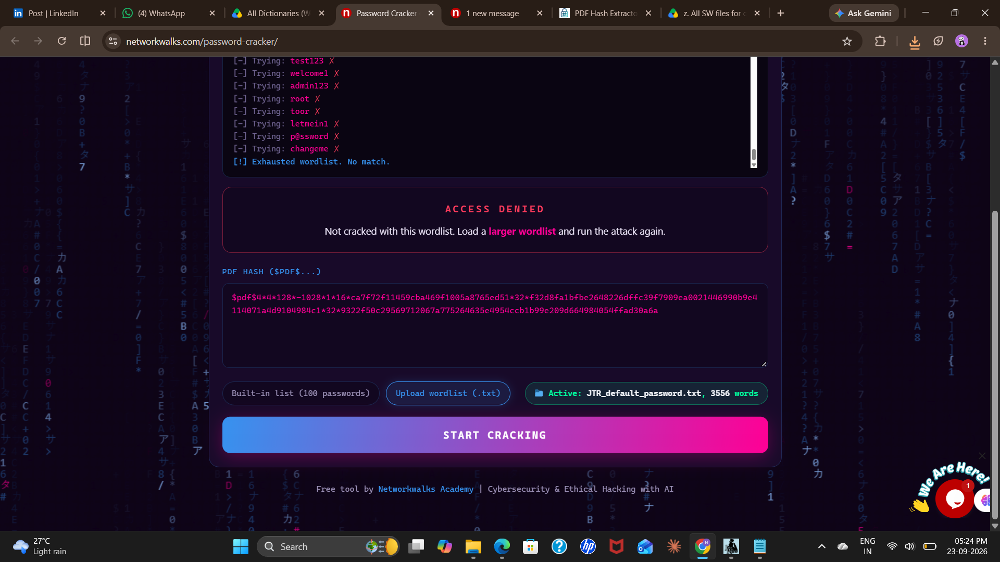

### Result

Successfully completed the **Password Cracking with NetworkWalks Tools** practical module using the NetworkWalks Hash Calculator and Password Cracker.

---

## Overall Week 3 Outcome

Completed both Week 3 password-cracking modules and documented the practical procedures and results using screenshots.

The activities were performed as part of the authorized NetworkWalks internship training environment.

## Disclaimer

All activities documented in this repository were performed for authorized cybersecurity training and educational purposes within the NetworkWalks internship/lab environment.
